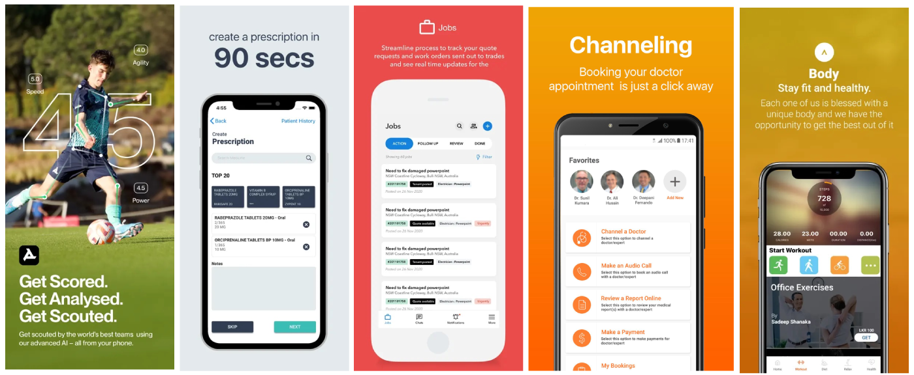

# Hello, I'm Thilina Chamath Hewagama 🇱🇰

##### SwiftUI | Objective-C | ReactNative (Android, iOS)
I am a 🧑‍🎓graduate Mobile Application Engineer specializing in native iOS / React Native development from Colombo, Sri Lanka. With over 12 years of experience, I've honed my skills in creating intuitive and performant applications.

#### Certifications
- [Writing Clean Code [Udemy]](http://ude.my/UC-8a0d43e5-d248-4920-9717-524eaeae05eb)
- [React Native: Tips, Tricks, and Techniques [Udemy]](http://ude.my/UC-a813e8ee-1ece-451d-8045-d50c4fba81cb)
- [Android App Development Masterclass using Kotlin [Udemy]](http://ude.my/UC-8e2e4853-b75c-4fd6-890b-f8f5720c7f84)
- [Master CI/CD for iOS Developers [Udemy]](http://ude.my/UC-25454791-e42b-407c-8cbc-6389a3265f12)
- [Programming macOS Using SwiftUI [Udemy]](http://ude.my/UC-1b0c2fba-798b-4a76-adcc-50dc7b1b7979)

#### Apps I’ve Built and Contributed To
- [Ayubo.pro](https://apps.apple.com/us/app/ayubo-pro/id1414129200) (on AppStore)
- [Ayubo.life](https://apps.apple.com/us/app/ayubo-life/id1198169710) (on AppStore)
- [Property Manager](https://apps.apple.com/us/app/b-a-property-manager/id1594166106) (on AppStore)
- [aiScout (AppStore)](https://apps.apple.com/gb/app/aiscout/id1508291341) (on AppStore)
- [aiScout (PlayStore)](https://play.google.com/store/apps/details?id=com.aiscout.player&hl=en_US) (on PlayStore)
- [📱(20+) More Apps](./MoreApps.md)

#### YouTube Channel

  

Feel free to connect with me here on GitHub or through any of the platforms below!
- [LinkedIn](https://www.linkedin.com/in/thilina-hewagama-ios/)
- [Twitter](https://twitter.com/thilina3001)

Thank you for visiting my profile!
[Connect](mailto:thilina3001@gmail.com)
