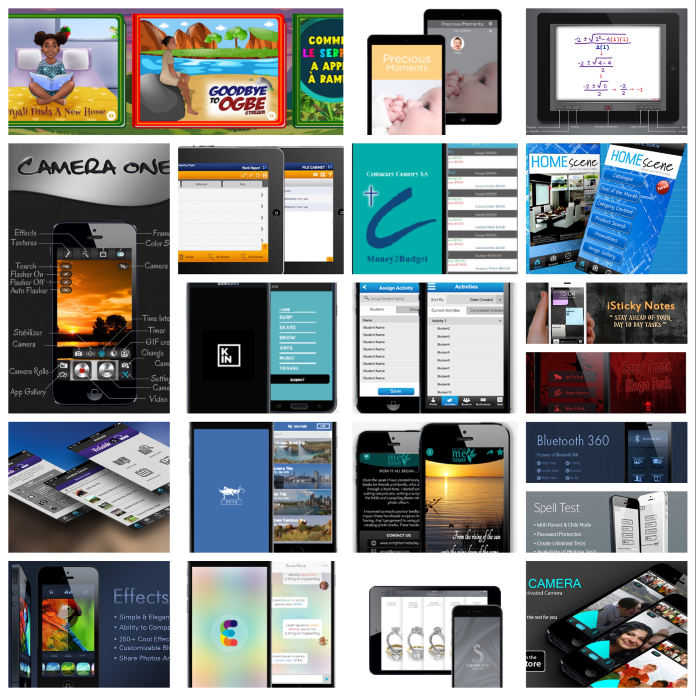

# Hello, I'm Thilina Chamath Hewagama 🇱🇰

##### SwiftUI | Objective-C | ReactNative ( Android, iOS )
I am a 🧑‍🎓graduate Mobile Application Engineer specializing in native iOS / React Native development from Colombo, Sri Lanka. With over 12 years of experience, I've honed my skills in creating intuitive and performant applications.

#### Certifications

- [Writing Clean Code [Udemy]](http://ude.my/UC-8a0d43e5-d248-4920-9717-524eaeae05eb)
- [React Native: Tips, Tricks, and Techniques [Udemy]](http://ude.my/UC-a813e8ee-1ece-451d-8045-d50c4fba81cb)
- [Android App Development Masterclass using Kotlin [Udemy]](http://ude.my/UC-8e2e4853-b75c-4fd6-890b-f8f5720c7f84)
- [Master CI/CD for iOS Developers [Udemy]]( http://ude.my/UC-25454791-e42b-407c-8cbc-6389a3265f12)

#### Apps on Store 
- [Ayubo.pro](https://apps.apple.com/us/app/ayubo-pro/id1414129200)
- [Ayubo.life](https://apps.apple.com/us/app/ayubo-life/id1198169710)
- [Property Manager](https://apps.apple.com/us/app/b-a-property-manager/id1594166106)
- [aiScout (AppStore)](https://apps.apple.com/gb/app/aiscout/id1508291341)
- [aiScout (PlayStore)](https://play.google.com/store/apps/details?id=com.aiscout.player&hl=en_US)

- [More Apps](./MoreApps.md)

<!--
## About Me
- 🔭 I’m currently working on various freelance projects and exploring macOS app development using SwiftUI.
- 🌱 I’m currently learning back-end development to build robust APIs for my apps.
- 👯 I’m looking to collaborate on innovative iOS projects and open source contributions.
- 🤔 I’m seeking advice on product design engineering and advanced iOS architectures.
- 💬 Ask me about anything iOS, Swift, or mobile app development!
- 📫 How to reach me: [thilina3001@gmail.com](mailto:thilina3001@gmail.com)
-->

<!--
## Projects
Here are some projects I'm proud of:
- **[Project Name]**: A brief description of your project. [View on GitHub](#)
- **[Another Project]**: An overview of another impressive project. [View on GitHub](#)
-->

Feel free to connect with me here on GitHub or through any of the platforms below!
- [LinkedIn](https://www.linkedin.com/in/thilina-hewagama-ios/)
- [Twitter](https://twitter.com/thilina3001)

Thank you for visiting my profile!
[Connect](mailto:thilina3001@gmail.com)

